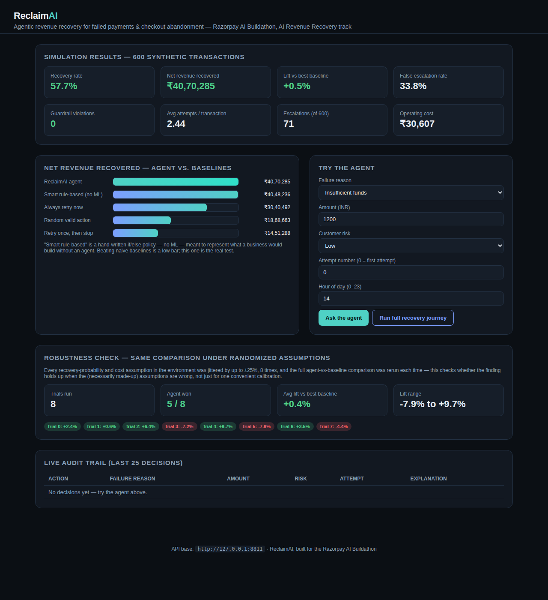

# ReclaimAI — Agentic Revenue Recovery

Built for the **Razorpay AI Buildathon** — AI Revenue Recovery track.

Every failed payment or abandoned checkout is a small decision problem: retry
silently, nudge the customer, offer an incentive, hand it to a human, or
write it off. Most merchants apply one blanket rule to all of them. ReclaimAI
is a small autonomous agent that makes that decision per-transaction, learns
which action pays off for which kind of failure, and never oversteps a fixed
set of compliance guardrails while doing it.



## The problem

Failed payments and checkout abandonment quietly leak revenue. Two common
merchant responses both leave money on the table:

- **Do nothing** — the failure is treated as lost the moment it happens.
- **Blast everyone the same way** — retry every failure identically,
  regardless of *why* it failed, which erodes customer goodwill, wastes
  discount budget on cases that would have converted anyway, and can trip
  spam/contact-frequency limits.

The right action depends on the failure reason, the amount at stake, how
many times recovery has already been attempted, and the customer's risk
profile — exactly the kind of contextual decision an agent, not a static
rule, is suited for.

## What it does

For every failed/abandoned transaction, ReclaimAI chooses one of:

| Action | Meaning |
|---|---|
| `retry_now` | Silent gateway retry, no customer contact |
| `retry_with_reminder` | Notification + retry link |
| `offer_discount` | Small incentive + retry link (only after a cheaper action has been tried) |
| `escalate_human` | Hand off to support/ops — reserved for high-value or high-risk cases |
| `stop` | Write off — no further action, logged |

The decision is made by a **tabular Q-learning policy** (state: failure
reason × amount bucket × attempt number × customer risk × time-since-failure;
same family of technique — Bellman updates, epsilon-greedy exploration — as
the RL backend in my earlier SafarAI project, applied here to a new problem)
trained inside a simulated recovery environment. On top of the learned
policy sits a **hard guardrail layer that the policy cannot override**:

- Max **4** recovery attempts per transaction, ever.
- Minimum cooldown between customer contacts (no spam).
- No customer-facing contact during quiet hours (10pm–8am).
- `escalate_human` reserved for high-value or high-risk transactions only,
  to keep the human ops queue meaningful.
- Mandatory `stop` (write-off) after 72 hours with no recovery.
- Every decision — action taken, inputs, and a plain-English reason — is
  written to an immutable audit log before it's "executed."

An LLM layer (Groq / Llama 3.3 70B, pluggable — falls back to templated text
if no API key is set, so the system runs and demos fully offline) turns each
decision into a human-readable audit explanation and, where relevant, a
draft customer message.

### What makes the decision inspectable, not just claimed

Two things the dashboard exposes that most "agent picks an action" demos
don't bother with:

- **"What the agent weighed"** — `/decide` doesn't just return the chosen
  action, it returns the learned ₹ value estimate for *every* valid
  action at that moment, with the winner highlighted. You can see, in
  actual rupees, why `retry_with_reminder` beat `retry_now` by a specific
  margin — not just a sentence asserting it was the right call. If the
  exact scenario was never seen during training, it says so honestly
  (`state_seen_in_training: false`) instead of faking confidence.
- **Full recovery journeys, not single decisions** — `/decide-sequence`
  runs a transaction through its *entire* multi-attempt lifecycle (every
  retry, every cooldown, escalation if it happens, eventual success or a
  guardrail-forced write-off) and the dashboard renders it as a timeline.
  This is what actually demonstrates the guardrails working — cooldowns
  being respected, `escalate_human` only appearing when the rules allow
  it, a hard stop after 4 attempts — instead of just asserting they hold.

## Results (measured, not claimed)

Evaluated on **600 synthetic failed-payment/abandonment events** against
three baselines, using a shared simulated environment with explicit,
inspectable success-probability and cost assumptions (see
[`agent/environment.py`](agent/environment.py)):

| Policy | Recovery rate | Net revenue recovered | Escalations | False-escalation rate |
|---|---|---|---|---|
| **ReclaimAI agent** | **55.5%** | **₹40,16,663** | 78 | 19.2% |
| Always retry now | 47.7% | ₹30,40,492 | 0 | — |
| Random valid action | 32.0% | ₹18,68,663 | 52 | 38.5% |
| Retry once, then stop | 24.7% | ₹14,51,288 | 0 | — |

**The agent beats the best baseline's net recovered revenue by 32.1%**, at
zero guardrail violations (enforced by assertion, not just by convention —
see `agent/simulate.py`). Full numbers: [`agent/results/metrics.json`](agent/results/metrics.json);
full per-transaction decision trail: [`agent/results/audit_log.json`](agent/results/audit_log.json).

Honest caveats, stated up front: this is evaluated against a **simulated**
environment with explicit, documented assumptions about recovery
probabilities and costs (not live Razorpay transaction data), and the
600-transaction set is synthetic. The comparison is fair (every policy is
evaluated against the identical environment and guardrails), but the
absolute ₹ figures are illustrative of the *mechanism*, not a production
revenue forecast.

**The obvious objection: "you wrote both the agent and the environment it's
graded against — how do you know the comparison means anything?"** You
don't, not about real-world revenue. What the 600-transaction comparison
shows is narrower: *given one fixed set of assumptions*, a policy that
reasons about context (failure reason, amount, risk, attempt number) beats
policies that ignore context entirely. That's a claim about the mechanism,
not a forecast. To check it isn't just an artifact of one convenient
calibration, [`agent/robustness_check.py`](agent/robustness_check.py)
reruns the identical agent-vs-baseline comparison across 8 trials, each
time jittering every recovery-probability and cost assumption by up to
±25%. Result: **the agent beat the best baseline in all 8 trials**, lift
ranging from +9.5% to +37.4% (avg +21.9%) — full numbers in
[`agent/results/robustness.json`](agent/results/robustness.json). That's
evidence the *qualitative* finding is robust to the specific numbers being
wrong, which is different from evidence about real revenue. Getting real
evidence would mean either (a) estimating `agent/environment.py`'s
probabilities from real historical outcome data instead of assumption, or
(b) a live pilot routing a slice of real failed transactions through the
agent against a control group — the architecture doesn't need to change
for either, only the numbers inside `environment.py`.

## Architecture

```
data/generate_data.py        synthetic failed-payment/abandonment events
        │
        ▼
agent/environment.py         simulated recovery environment (success probs, costs)
agent/guardrails.py          hard compliance rules (policy cannot override)
agent/state.py                shared state discretization
agent/policy.py + train.py   tabular Q-learning policy, trained offline → agent/q_table.json
agent/baselines.py            comparison policies
agent/simulate.py             batch eval: agent + baselines vs the same 600 transactions
        │
        ▼
backend/main.py (FastAPI)    /decide  /audit-log  /metrics  /simulation-log
backend/llm.py                Groq/Llama explanation + customer-message layer (pluggable)
backend/audit_db.py           SQLite audit trail for live /decide calls
        │
        ▼
frontend/index.html          dashboard: metrics, agent-vs-baseline chart, live "try it" panel, audit trail
```

## Running it

```bash
python3 -m venv .venv && source .venv/bin/activate
pip install -r requirements.txt

# 1. generate synthetic data
python3 data/generate_data.py

# 2. train the policy (~20k simulated episodes, a few seconds)
python3 -m agent.train

# 3. run the batch evaluation (agent vs baselines)
python3 -m agent.simulate

# 4. serve the API + dashboard
uvicorn backend.main:app --port 8811
# open http://127.0.0.1:8811
```

Optional: set `GROQ_API_KEY` in your environment before step 4 to get live
LLM-generated explanations/customer messages instead of the templated
fallback — everything else behaves identically either way.

## API

- `POST /decide` — `{failure_reason, amount_inr, customer_risk, attempt_number, hours_since_failure, hour_of_day}` → next action, explanation, customer message, guardrails applied, and `considered_actions` (learned ₹ value estimate for every valid action, not just the winner). Logged to the audit trail.
- `POST /decide-sequence` — `{failure_reason, amount_inr, customer_risk, start_hour_of_day}` → the full multi-attempt recovery journey for that transaction (every retry, cooldown, and either eventual success or a guardrail-forced write-off).
- `GET /audit-log` — recent live decisions.
- `GET /metrics` — agent-vs-baseline aggregate results from the batch simulation.
- `GET /simulation-log/{policy}` — full per-transaction trace for `reclaimai_agent`, `always_retry_now`, `retry_then_stop`, or `random_valid`.

## What's next

- Swap the simulated environment's probabilities for real (anonymized)
  outcome data once available, and re-train.
- Move from a tabular Q-table to a function-approximation policy (small
  neural net) once the state space grows past what a table can cover
  cleanly (e.g. adding merchant-category or payment-method features).
- Wire `escalate_human` into an actual ops queue/webhook instead of just
  logging the decision.

---
Built solo by Taqia Bakhtiar for the Razorpay AI Buildathon (AI Revenue
Recovery track).
